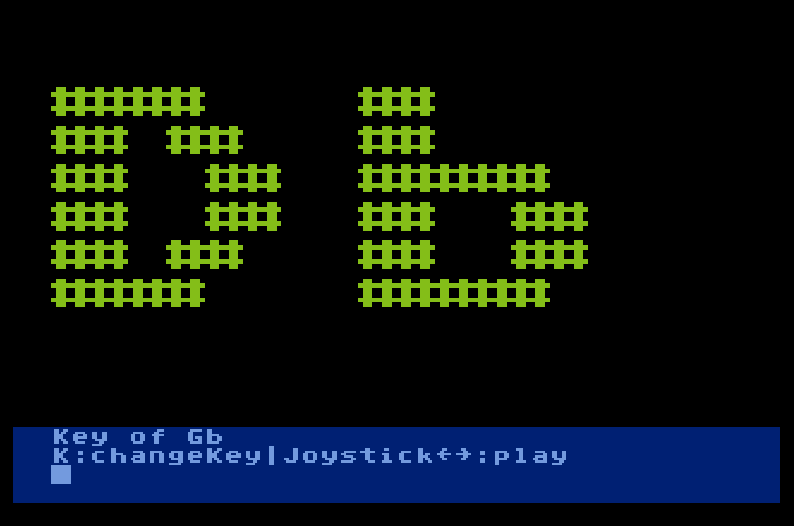

# 10line-2014-BluesJam
Music program in Turbo BASIC XL for Atari 8-bit. Entry for 2014 10-line BASIC contest

BluesJam plays a 12-bar blues chord progression in any of the 12 major keys (type K to change the key.) Use joystick left and right to set the note to play along as the soloist. It always uses the minor blues scale that fits with the key you've chosen. Press the fire button to play that note. (Just try holding the button down and moving the joystick left and right.)
 
This was my first program in TBXL, having only learned about the language four days before.
